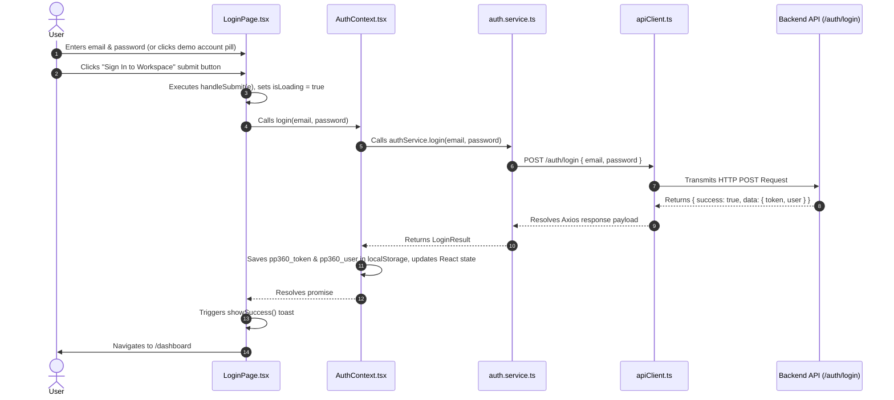
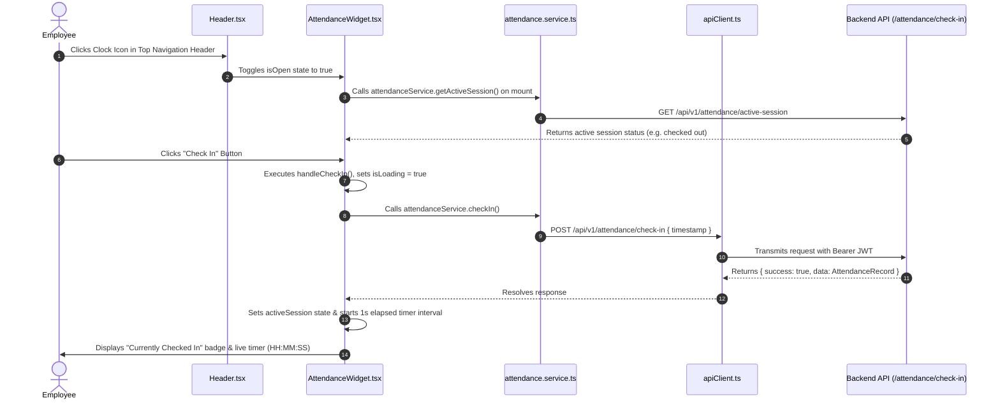
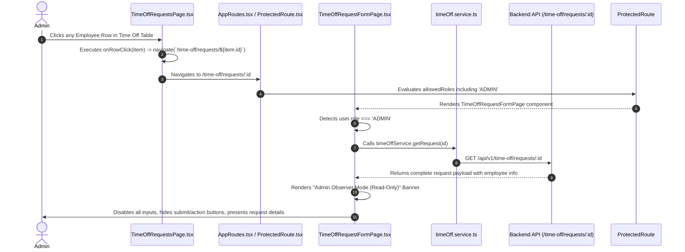
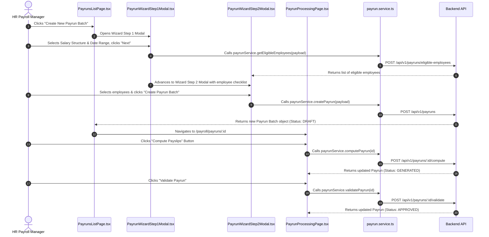

# FRONTEND_ELEMENT_ACCESS_MAP.md
## PeoplePay360 HR & Payroll - Frontend Element Access & Execution Map

> **Document Purpose**: This comprehensive documentation map provides a complete, authoritative reference for the PeoplePay360 frontend codebase (`frontend/src`). It traces every UI element, button, link, form, modal, table row action, state, hook, event handler, API service call, backend endpoint, route, and role-based access decision across the entire application.

---

## 1. Quick Lookup Matrix

| Feature / UI Element | Interactive Element | Component / Page | File Path | Event Handler / Function | API Service Function | Backend API Endpoint | Route / Action Result |
| :--- | :--- | :--- | :--- | :--- | :--- | :--- | :--- |
| **Demo Credential Pill** | Button click | `LoginPage` | `frontend/src/pages/LoginPage.tsx` | `handleSelectDemo(email, pass)` | N/A | N/A | Fills email & password inputs |
| **Login Submit** | Form submit button | `LoginPage` | `frontend/src/pages/LoginPage.tsx` | `handleSubmit(e)` | `authService.login(email, pass)` | `POST /api/v1/auth/login` | Stores JWT token & user, navigates to `/dashboard` |
| **Logout** | Dropdown button | `Header` | `frontend/src/components/layout/Header.tsx` | `logout()` | N/A (Clears localStorage) | N/A | Clears token, redirects to `/login` |
| **Punch Clock Check-In** | Modal button | `AttendanceWidget` | `frontend/src/components/attendance/AttendanceWidget.tsx` | `handleCheckIn()` | `attendanceService.checkIn()` | `POST /api/v1/attendance/check-in` | Starts active session timer & updates state |
| **Punch Clock Check-Out** | Modal button | `AttendanceWidget` | `frontend/src/components/attendance/AttendanceWidget.tsx` | `handleCheckOut()` | `attendanceService.checkOut()` | `POST /api/v1/attendance/check-out` | Ends session, shows worked hours toast |
| **Create Employee** | Page Header Button | `EmployeeListPage` | `frontend/src/pages/EmployeeListPage.tsx` | `onClick={() => navigate('/hr/employees/new')}` | N/A | N/A | Navigates to `/hr/employees/new` |
| **Save Employee** | Form Submit | `EmployeeFormPage` | `frontend/src/pages/EmployeeFormPage.tsx` | `handleSubmit(e)` | `employeeService.create()` / `update()` | `POST /api/v1/employees` or `PUT /api/v1/employees/:id` | Saves employee & navigates to `/hr/employees` |
| **Employee Table Row** | Table Row Click | `EmployeeTable` | `frontend/src/components/employees/EmployeeTable.tsx` | `onRowClick(employee)` | N/A | N/A | Navigates to `/hr/employees/:id` |
| **Approve Time Off** | Table Action Button | `TimeOffRequestsPage` | `frontend/src/pages/TimeOffRequestsPage.tsx` | `handleApprove(id)` | `timeOffService.approveRequest(id)` | `PUT /api/v1/time-off/requests/:id/approve` | Refreshes requests & shows success toast |
| **Refuse Time Off** | Table Action Button | `TimeOffRequestsPage` | `frontend/src/pages/TimeOffRequestsPage.tsx` | `handleRefuse(id)` | `timeOffService.refuseRequest(id)` | `PUT /api/v1/time-off/requests/:id/refuse` | Refreshes requests & shows success toast |
| **Request Row Click (Admin)**| Table Row Click | `TimeOffRequestsPage` | `frontend/src/pages/TimeOffRequestsPage.tsx` | `onRowClick(item)` | N/A | N/A | Navigates to `/time-off/requests/:id` (Read-Only Observer Mode) |
| **Allocation Row Click (Admin)**| Table Row Click | `TimeOffAllocationsPage` | `frontend/src/pages/TimeOffAllocationsPage.tsx` | `onRowClick(item)` | N/A | N/A | Navigates to `/time-off/allocations/:id` (Read-Only Observer Mode) |
| **Create Payrun (Step 1)**| Header Button | `PayrunsListPage` | `frontend/src/pages/PayrunsListPage.tsx` | `setIsWizardOpen(true)` | N/A | N/A | Opens `PayrunWizardStep1Modal` |
| **Fetch Eligible Employees**| Wizard Step 1 Next | `PayrunWizardStep1Modal` | `frontend/src/components/payrun/PayrunWizardStep1Modal.tsx` | `handleNext()` | `payrunService.getEligibleEmployees()` | `POST /api/v1/payruns/eligible-employees` | Advances to `PayrunWizardStep2Modal` |
| **Finalize Payrun Creation**| Wizard Step 2 Submit | `PayrunWizardStep2Modal` | `frontend/src/components/payrun/PayrunWizardStep2Modal.tsx` | `handleCreate()` | `payrunService.createPayrun()` | `POST /api/v1/payruns` | Creates payrun batch & navigates to processing |
| **Compute Payrun Batch** | Processing Button | `PayrunProcessingPage` | `frontend/src/pages/PayrunProcessingPage.tsx` | `handleCompute()` | `payrunService.computePayrun(id)` | `POST /api/v1/payruns/:id/compute` | Calculates gross/net wages & updates status |
| **Validate Payrun Batch** | Processing Button | `PayrunProcessingPage` | `frontend/src/pages/PayrunProcessingPage.tsx` | `handleValidate()` | `payrunService.validatePayrun(id)` | `POST /api/v1/payruns/:id/validate` | Locks payrun batch |
| **Mark Payrun Paid** | Processing Button | `PayrunProcessingPage` | `frontend/src/pages/PayrunProcessingPage.tsx` | `handleMarkPaid()` | `payrunService.markPaid(id)` | `POST /api/v1/payruns/:id/mark-paid` | Updates batch status to `PAID` |
| **Send Email Payslips** | Processing Button | `PayrunProcessingPage` | `frontend/src/pages/PayrunProcessingPage.tsx` | `handleSendPayslips()` | `payrunService.sendPayslips(id)` | `POST /api/v1/payruns/:id/send-payslips` | Dispatches PDF payslips via email |
| **View Payslip PDF** | Table Action Button | `PayslipsListPage` | `frontend/src/pages/PayslipsListPage.tsx` | `setSelectedPdfId(id)` | `payrunService.getPayslipPdfUrl(id)` | `GET /api/v1/payslips/:id/pdf` | Opens `PayslipPdfModal` with inline iframe |
| **Create User Account** | Header Button | `UserManagementPage` | `frontend/src/pages/UserManagementPage.tsx` | `handleCreateUser(payload)` | `payrunService.createUser(payload)` | `POST /api/v1/users` | Creates user credentials & refreshes user list |
| **Reset Password** | Table Action Button | `UserManagementPage` | `frontend/src/pages/UserManagementPage.tsx` | `handleResetPassword(id, pass)`| `payrunService.resetUserPassword(id, pass)`| `POST /api/v1/users/:id/reset-password` | Updates password & closes modal |

---

## 2. File-to-Feature Index

### Core Architecture & Routing
- `frontend/src/main.tsx`: React application entry point. Wraps app in `BrowserRouter`, `AuthProvider`, and `NotificationProvider`.
- `frontend/src/App.tsx`: Top-level router host. Renders `AppRoutes` and global `ToastContainer`.
- `frontend/src/routes/AppRoutes.tsx`: Central route mapping table. Defines public, protected, and role-restricted routes.
- `frontend/src/routes/ProtectedRoute.tsx`: Route authentication & authorization guard. Verifies token validity and enforces system roles (`ADMIN`, `HR_MANAGER`, `HR_PAYROLL_MANAGER`, `HR_PAYROLL_USER`, `EMPLOYEE`).

### Context & State Management
- `frontend/src/context/AuthContext.tsx`: Manages authentication state, user session (`AuthUser`), token persistence in `localStorage` (`pp360_token`, `pp360_user`), `login()`, `logout()`, and role verification (`hasRole()`).
- `frontend/src/context/NotificationContext.tsx`: Toast notification store. Provides `showSuccess()`, `showError()`, `showWarning()`, `showInfo()`, and auto-dismiss timer logic.

### Services & API Integration
- `frontend/src/services/apiClient.ts`: Axios client configured with base URL `/api/v1`, 30s timeout, request token injection (`Authorization: Bearer <token>`), and global 401 unauthenticated response interceptor.
- `frontend/src/services/auth.service.ts`: Endpoints for authentication (`/auth/login`, `/auth/me`).
- `frontend/src/services/attendance.service.ts`: Attendance APIs (`/attendance`, `/attendance/active-session`, `/attendance/check-in`, `/attendance/check-out`).
- `frontend/src/services/employee.service.ts`: Employee CRUD APIs (`/employees`, `/employees/:id`).
- `frontend/src/services/timeOff.service.ts`: Leave management APIs (`/time-off/types`, `/time-off/requests`, `/time-off/allocations`).
- `frontend/src/services/payrun.service.ts`: Comprehensive payroll, payslips, structures, rules, dashboard metrics, contracts, schedules, users, and department APIs.

### Layout Components
- `frontend/src/components/layout/AppLayout.tsx`: Master shell layout combining `Header`, collapsible `Sidebar`, `MobileSidebar`, and scrollable page viewport (`<Outlet />`).
- `frontend/src/components/layout/Header.tsx`: Top navigation bar. Features breadcrumbs, punch clock toggle, notification drawer trigger, and user profile dropdown.
- `frontend/src/components/layout/Sidebar.tsx`: Accordion navigation sidebar with role-based link visibility, active state highlighting, and persistent collapse memory.
- `frontend/src/components/layout/MobileSidebar.tsx`: Responsive mobile navigation drawer overlay.
- `frontend/src/components/layout/NotificationDrawer.tsx`: Popover drawer displaying real-time system alerts, unread counts, and "Mark as Read" triggers.

### Module Pages & Components
- **Dashboard**: `PayrollDashboardPage.tsx`, `KpiCardGroup.tsx`, `DepartmentCostChart.tsx`, `SalaryTrendChart.tsx`, `FilterBar.tsx`, `AlertsCard.tsx`
- **Employees**: `EmployeeListPage.tsx`, `EmployeeFormPage.tsx`, `EmployeeTable.tsx`, `EmployeeCard.tsx`, `EmployeeForm.tsx`
- **Contracts & Schedules**: `ContractListPage.tsx`, `ContractFormPage.tsx`, `WorkingScheduleListPage.tsx`, `WorkingScheduleFormPage.tsx`, `ScheduleRoleView.tsx`
- **Attendance**: `AttendanceListPage.tsx`, `AttendanceFormPage.tsx`, `AttendanceTable.tsx`, `AttendanceWidget.tsx`
- **Time Off**: `TimeOffHub.tsx`, `TimeOffRequestsPage.tsx`, `TimeOffRequestFormPage.tsx`, `TimeOffAllocationsPage.tsx`, `TimeOffAllocationFormPage.tsx`, `TimeOffTypesListPage.tsx`, `TimeOffTypeFormPage.tsx`
- **Payroll & Payruns**: `PayrunsListPage.tsx`, `PayrunProcessingPage.tsx`, `PayrunStatusBadge.tsx`, `PayrunWizardStep1Modal.tsx`, `PayrunWizardStep2Modal.tsx`
- **Payslips**: `PayslipsListPage.tsx`, `PayslipComputationPage.tsx`, `PayslipBreakdownTable.tsx`, `PayslipPdfModal.tsx`
- **Salary Configuration**: `SalaryStructuresListPage.tsx`, `SalaryStructureFormPage.tsx`, `SalaryRulesListPage.tsx`, `SalaryRuleFormPage.tsx`
- **User Management**: `UserManagementPage.tsx`, `CreateUserModal.tsx`, `ResetPasswordModal.tsx`

---

## 3. Architecture & Core Execution Flows

### 3.1 Authentication & Login Flow

### 3.2 Attendance Check-In / Punch Clock Flow

### 3.3 Admin Read-Only Time Off Inspection Flow

### 3.4 Payrun Batch Processing Flow

---

## 4. Module-by-Module Element Mapping

### 4.1 Authentication & Profile Module
**Primary Component**: `frontend/src/pages/LoginPage.tsx`  
**Context/Service**: `AuthContext.tsx`, `auth.service.ts`

| UI Element | Source File | Function / Handler | API Call | Backend Endpoint | Result / Behavior |
| :--- | :--- | :--- | :--- | :--- | :--- |
| **Demo Credentials Pill** | `LoginPage.tsx` | `handleSelectDemo(email, pass)` | None | None | Populates email/password state with role credentials |
| **Work Email Input** | `LoginPage.tsx` | `onChange={(e) => setEmail(...)}` | None | None | Binds text state to `email` |
| **Password Input** | `LoginPage.tsx` | `onChange={(e) => setPassword(...)}` | None | None | Binds text state to `password` |
| **Sign In Button** | `LoginPage.tsx` | `handleSubmit(e)` | `authService.login()` | `POST /api/v1/auth/login` | Authenticates, sets local storage, navigates to `/dashboard` |
| **Header User Badge** | `Header.tsx` | `onClick={() => setIsUserMenuOpen(...)}` | None | None | Toggles popover user menu |
| **Sign Out Button** | `Header.tsx` | `logout()` | None | None | Invokes `clearStorage()`, redirects window to `/login` |

---

### 4.2 Layout, Navigation & Notifications Module
**Components**: `Header.tsx`, `Sidebar.tsx`, `MobileSidebar.tsx`, `NotificationDrawer.tsx`

| UI Element | Source File | Function / Handler | API Call | Backend Endpoint | Result / Behavior |
| :--- | :--- | :--- | :--- | :--- | :--- |
| **Breadcrumb Links** | `Header.tsx` | `<Link to={routeTo}>` | None | None | Navigates to ancestor routes (e.g. `/hr`, `/payroll`) |
| **Clock Icon** | `Header.tsx` | `onClick={() => setIsAttendanceOpen(...)}` | None | None | Opens/closes `AttendanceWidget` dropdown |
| **Bell Icon** | `Header.tsx` | `onClick={() => setIsNotificationsOpen(...)}` | None | None | Opens/closes `NotificationDrawer` popover |
| **Mark All Read** | `NotificationDrawer.tsx` | `handleMarkAllAsRead()` | None | None | Sets `isRead: true` for all drawer notification items |
| **Mark Single Read**| `NotificationDrawer.tsx` | `handleMarkAsRead(id)` | None | None | Sets `isRead: true` for specific item ID |
| **Sidebar Accordion**| `Sidebar.tsx` | `toggleSection(key)` | None | None | Expands/collapses section (`core`, `time`, `payroll`, `admin`) |
| **Nav Links** | `Sidebar.tsx` | `<NavLink to="...">` | None | None | Navigates to selected module route |

---

### 4.3 Dashboard Module
**Page File**: `frontend/src/pages/PayrollDashboardPage.tsx`  
**Child Components**: `KpiCardGroup.tsx`, `DepartmentCostChart.tsx`, `SalaryTrendChart.tsx`, `FilterBar.tsx`, `AlertsCard.tsx`

| UI Element | Source File | Function / Handler | API Call | Backend Endpoint | Result / Behavior |
| :--- | :--- | :--- | :--- | :--- | :--- |
| **Month Selector** | `FilterBar.tsx` | `onMonthChange(e.target.value)` | `payrunService.getDashboardMetrics()` | `GET /api/v1/dashboard/metrics` | Refreshes metrics for chosen month |
| **Year Selector** | `FilterBar.tsx` | `onYearChange(e.target.value)` | `payrunService.getSalaryTrend()` | `GET /api/v1/dashboard/salary-trend` | Refreshes trend chart data for chosen year |
| **Department Filter**| `FilterBar.tsx` | `onDepartmentChange(val)` | `payrunService.getDepartmentCosts()` | `GET /api/v1/dashboard/department-costs` | Filters department cost distribution chart |
| **Alert Action Link**| `AlertsCard.tsx` | `<Link to={alert.link}>` | None | None | Navigates directly to alert target (e.g. `/payroll/payruns/:id`) |

---

### 4.4 Employee Management Module
**Pages**: `EmployeeListPage.tsx`, `EmployeeFormPage.tsx`  
**Components**: `EmployeeTable.tsx`, `EmployeeCard.tsx`, `EmployeeForm.tsx`

| UI Element | Source File | Function / Handler | API Call | Backend Endpoint | Result / Behavior |
| :--- | :--- | :--- | :--- | :--- | :--- |
| **Add Employee Button**| `EmployeeListPage.tsx` | `onClick={() => navigate('/hr/employees/new')}` | None | None | Opens blank employee creation form |
| **Search Input** | `EmployeeListPage.tsx` | `onChange={(e) => setSearchTerm(...)}` | None | None | Filters employee table by name, email, code |
| **Department Filter** | `EmployeeListPage.tsx` | `onChange={(e) => setSelectedDepartment(...)}` | None | None | Filters employee table by department ID |
| **Table Row Click** | `EmployeeTable.tsx` | `onRowClick(employee)` | None | None | Navigates to `/hr/employees/:id` |
| **Save Employee Form**| `EmployeeFormPage.tsx` | `handleSubmit(e)` | `employeeService.create()` / `update()` | `POST /employees` or `PUT /employees/:id` | Saves record & navigates back to list |
| **Delete Employee** | `EmployeeFormPage.tsx` | `handleDelete()` | `employeeService.delete(id)` | `DELETE /api/v1/employees/:id` | Deletes employee & navigates to list |

---

### 4.5 Attendance & Punch Clock Module
**Pages**: `AttendanceListPage.tsx`, `AttendanceFormPage.tsx`  
**Components**: `AttendanceTable.tsx`, `AttendanceWidget.tsx`

| UI Element | Source File | Function / Handler | API Call | Backend Endpoint | Result / Behavior |
| :--- | :--- | :--- | :--- | :--- | :--- |
| **Punch Clock Check-In**| `AttendanceWidget.tsx` | `handleCheckIn()` | `attendanceService.checkIn()` | `POST /api/v1/attendance/check-in` | Initiates active attendance session |
| **Punch Clock Check-Out**| `AttendanceWidget.tsx` | `handleCheckOut()` | `attendanceService.checkOut()` | `POST /api/v1/attendance/check-out` | Closes active session, logs worked hours |
| **Date Range Filter**| `AttendanceListPage.tsx` | `onChange={(e) => setStartDate(...)}` | `attendanceService.list()` | `GET /api/v1/attendance?startDate=...` | Refreshes attendance log table |
| **Table Row Click** | `AttendanceTable.tsx` | `onRowClick(item)` | None | None | Navigates to `/hr/attendance/:id` |
| **Save Correction** | `AttendanceFormPage.tsx` | `handleSubmit(e)` | `attendanceService.update(id, payload)` | `PUT /api/v1/attendance/:id` | Updates attendance record details |

---

### 4.6 Time Off Module (Requests, Allocations & Types)
**Pages**: `TimeOffHub.tsx`, `TimeOffRequestsPage.tsx`, `TimeOffRequestFormPage.tsx`, `TimeOffAllocationsPage.tsx`, `TimeOffAllocationFormPage.tsx`, `TimeOffTypesListPage.tsx`, `TimeOffTypeFormPage.tsx`

| UI Element | Source File | Function / Handler | API Call | Backend Endpoint | Result / Behavior |
| :--- | :--- | :--- | :--- | :--- | :--- |
| **New Request Button** | `TimeOffRequestsPage.tsx` | `onClick={() => navigate('/time-off/requests/new')}` | None | None | Opens request creation form (Disabled for Admin) |
| **Approve Request** | `TimeOffRequestsPage.tsx` | `handleApprove(id)` | `timeOffService.approveRequest(id)` | `PUT /api/v1/time-off/requests/:id/approve` | Approves request & updates balance |
| **Refuse Request** | `TimeOffRequestsPage.tsx` | `handleRefuse(id)` | `timeOffService.refuseRequest(id)` | `PUT /api/v1/time-off/requests/:id/refuse` | Rejects request with optional reason |
| **Request Row Click** | `TimeOffRequestsPage.tsx` | `onRowClick(item)` | `timeOffService.getRequest(id)` | `GET /api/v1/time-off/requests/:id` | Navigates to detail view (Read-Only for Admin) |
| **New Allocation Button**| `TimeOffAllocationsPage.tsx` | `onClick={() => navigate('/time-off/allocations/new')}` | None | None | Opens allocation creation form (Disabled for Admin) |
| **Allocation Row Click**| `TimeOffAllocationsPage.tsx` | `onRowClick(item)` | `timeOffService.getAllocation(id)` | `GET /api/v1/time-off/allocations/:id` | Navigates to detail view (Read-Only for Admin) |
| **Save Leave Type** | `TimeOffTypeFormPage.tsx` | `handleSubmit(e)` | `timeOffService.createType()` / `updateType()` | `POST` / `PUT /api/v1/time-off/types` | Saves leave type configuration |

---

### 4.7 Payroll, Payruns & Payslips Module
**Pages**: `PayrunsListPage.tsx`, `PayrunProcessingPage.tsx`, `PayslipsListPage.tsx`, `PayslipComputationPage.tsx`  
**Components**: `PayrunWizardStep1Modal.tsx`, `PayrunWizardStep2Modal.tsx`, `PayslipBreakdownTable.tsx`, `PayslipPdfModal.tsx`

| UI Element | Source File | Function / Handler | API Call | Backend Endpoint | Result / Behavior |
| :--- | :--- | :--- | :--- | :--- | :--- |
| **Wizard Step 1 Next** | `PayrunWizardStep1Modal.tsx` | `handleNext()` | `payrunService.getEligibleEmployees()` | `POST /api/v1/payruns/eligible-employees` | Validates dates & fetches eligible employees |
| **Wizard Step 2 Submit**| `PayrunWizardStep2Modal.tsx` | `handleCreate()` | `payrunService.createPayrun()` | `POST /api/v1/payruns` | Creates Payrun & navigates to processing page |
| **Compute Payrun** | `PayrunProcessingPage.tsx` | `handleCompute()` | `payrunService.computePayrun(id)` | `POST /api/v1/payruns/:id/compute` | Calculates line items & updates state |
| **Validate Payrun** | `PayrunProcessingPage.tsx` | `handleValidate()` | `payrunService.validatePayrun(id)` | `POST /api/v1/payruns/:id/validate` | Locks payrun batch |
| **Mark Paid** | `PayrunProcessingPage.tsx` | `handleMarkPaid()` | `payrunService.markPaid(id)` | `POST /api/v1/payruns/:id/mark-paid` | Sets status to `PAID` |
| **Send Payslips Email** | `PayrunProcessingPage.tsx` | `handleSendPayslips()` | `payrunService.sendPayslips(id)` | `POST /api/v1/payruns/:id/send-payslips` | Dispatches PDF payslips to employees |
| **View PDF Modal Icon** | `PayslipsListPage.tsx` | `onClick={() => setSelectedPdfId(id)}` | `payrunService.getPayslipPdfUrl(id)` | `GET /api/v1/payslips/:id/pdf` | Opens `PayslipPdfModal` with PDF stream |
| **Download PDF Button** | `PayslipPdfModal.tsx` | `onClick={() => window.open(pdfUrl)}` | None | `GET /api/v1/payslips/:id/pdf` | Triggers browser PDF download |

---

### 4.8 User Management & Administration Module
**Page**: `UserManagementPage.tsx`  
**Components**: `CreateUserModal.tsx`, `ResetPasswordModal.tsx`

| UI Element | Source File | Function / Handler | API Call | Backend Endpoint | Result / Behavior |
| :--- | :--- | :--- | :--- | :--- | :--- |
| **Create User Button** | `UserManagementPage.tsx` | `onClick={() => setIsModalOpen(true)}` | None | None | Opens `CreateUserModal` |
| **Create User Submit** | `CreateUserModal.tsx` | `handleSubmit(e)` | `payrunService.createUser(payload)` | `POST /api/v1/users` | Creates user account & updates user table |
| **Reset Password Icon** | `UserManagementPage.tsx` | `onClick={() => setSelectedUserForReset(item)}` | None | None | Opens `ResetPasswordModal` for selected user |
| **Reset Password Submit**| `ResetPasswordModal.tsx` | `handleSubmit(e)` | `payrunService.resetUserPassword(id, pass)`| `POST /api/v1/users/:id/reset-password` | Resets password & displays success toast |

---

## 5. Shared & Reusable Components Reference

| Component File | Primary Purpose | Props / Controls Received | Events / Output Callbacks | Key Consumer Pages |
| :--- | :--- | :--- | :--- | :--- |
| `frontend/src/components/common/Button.tsx` | Reusable Styled Action Button | `variant`, `size`, `isLoading`, `disabled`, `icon` | `onClick` | Used across all forms & page headers |
| `frontend/src/components/common/SmartButton.tsx` | Async Button with feedback state | `variant`, `size`, `onClickAsync`, `successText` | `onClickAsync()` | Used in Payrun processing action bars |
| `frontend/src/components/common/Table.tsx` | Generic Data Table | `columns`, `data`, `keyExtractor`, `isLoading`, `onRowClick` | `onRowClick(item)` | Used in Employee, Attendance, Time Off, Payroll lists |
| `frontend/src/components/common/Modal.tsx` | Overlay Dialog Frame | `isOpen`, `title`, `onClose`, `children`, `footer` | `onClose()` | Used in Payrun Wizard, User Creation, Password Reset |
| `frontend/src/components/common/Badge.tsx` | Color-coded Status Pill | `status`, `label`, `variant` | None | Used across all table status columns |
| `frontend/src/components/common/Tabs.tsx` | Tabbed Navigation Bar | `tabs` (`id`, `label`, `count`), `activeTab` | `onChange(tabId)` | Used in `TimeOffHub`, `PayrunProcessingPage` |
| `frontend/src/components/common/ToastContainer.tsx` | Global Alert Banner Container | Consumes `useNotification()` | `dismiss(id)` | Rendered at root in `App.tsx` |

---

## 6. Frontend Routing & Navigation Matrix

| Path | Rendered Page Component | Allowed Roles | Access Wrapper | Fallback Redirect Target |
| :--- | :--- | :--- | :--- | :--- |
| `/login` | `LoginPage` | Public (Unauthenticated) | None | N/A |
| `/` | Redirect | All Authenticated | `<ProtectedRoute>` | Redirects to `/dashboard` |
| `/dashboard` | `PayrollDashboardPage` | All Authenticated | `<ProtectedRoute>` | `/login` if unauthenticated |
| `/hr/employees` | `EmployeeListPage` | All Authenticated | `<ProtectedRoute>` | `/login` if unauthenticated |
| `/hr/employees/:id` | `EmployeeFormPage` | All Authenticated | `<ProtectedRoute>` | `/login` if unauthenticated |
| `/hr/contracts` | `ContractListPage` | `HR_MANAGER`, `HR_PAYROLL_USER`, `HR_PAYROLL_MANAGER`, `ADMIN` | `<ProtectedRoute allowedRoles={...}>` | `/dashboard` if role unauthorized |
| `/hr/contracts/:id` | `ContractFormPage` | `HR_MANAGER`, `HR_PAYROLL_USER`, `HR_PAYROLL_MANAGER`, `ADMIN` | `<ProtectedRoute allowedRoles={...}>` | `/dashboard` if role unauthorized |
| `/hr/schedules` | `WorkingScheduleListPage` | All Authenticated | `<ProtectedRoute>` | `/login` if unauthenticated |
| `/hr/schedules/:id` | `WorkingScheduleFormPage` | All Authenticated | `<ProtectedRoute>` | `/login` if unauthenticated |
| `/hr/attendance` | `AttendanceListPage` | All Authenticated | `<ProtectedRoute>` | `/login` if unauthenticated |
| `/hr/attendance/:id` | `AttendanceFormPage` | All Authenticated | `<ProtectedRoute>` | `/login` if unauthenticated |
| `/time-off` | `TimeOffHub` | All Authenticated | `<ProtectedRoute>` | `/login` if unauthenticated |
| `/time-off/requests` | `TimeOffRequestsPage` | All Authenticated | `<ProtectedRoute>` | `/login` if unauthenticated |
| `/time-off/requests/:id` | `TimeOffRequestFormPage` | All Authenticated (Read-Only for `ADMIN`) | `<ProtectedRoute>` | `/login` if unauthenticated |
| `/time-off/allocations` | `TimeOffAllocationsPage` | All Authenticated | `<ProtectedRoute>` | `/login` if unauthenticated |
| `/time-off/allocations/:id` | `TimeOffAllocationFormPage` | All Authenticated (Read-Only for `ADMIN`) | `<ProtectedRoute>` | `/login` if unauthenticated |
| `/time-off/types` | `TimeOffTypesListPage` | `HR_MANAGER`, `HR_PAYROLL_MANAGER`, `ADMIN` | `<ProtectedRoute allowedRoles={...}>` | `/dashboard` if role unauthorized |
| `/time-off/types/:id` | `TimeOffTypeFormPage` | `HR_MANAGER`, `HR_PAYROLL_MANAGER`, `ADMIN` | `<ProtectedRoute allowedRoles={...}>` | `/dashboard` if role unauthorized |
| `/payroll/payruns` | `PayrunsListPage` | `HR_PAYROLL_USER`, `HR_PAYROLL_MANAGER`, `ADMIN` | `<ProtectedRoute allowedRoles={...}>` | `/dashboard` if role unauthorized |
| `/payroll/payruns/:id` | `PayrunProcessingPage` | `HR_PAYROLL_USER`, `HR_PAYROLL_MANAGER`, `ADMIN` | `<ProtectedRoute allowedRoles={...}>` | `/dashboard` if role unauthorized |
| `/payroll/payslips` | `PayslipsListPage` | `HR_PAYROLL_USER`, `HR_PAYROLL_MANAGER`, `ADMIN` | `<ProtectedRoute allowedRoles={...}>` | `/dashboard` if role unauthorized |
| `/payroll/payslips/:id` | `PayslipComputationPage` | `HR_PAYROLL_USER`, `HR_PAYROLL_MANAGER`, `ADMIN` | `<ProtectedRoute allowedRoles={...}>` | `/dashboard` if role unauthorized |
| `/payroll/structures` | `SalaryStructuresListPage` | `HR_PAYROLL_MANAGER`, `ADMIN` | `<ProtectedRoute allowedRoles={...}>` | `/dashboard` if role unauthorized |
| `/payroll/structures/:id` | `SalaryStructureFormPage` | `HR_PAYROLL_MANAGER`, `ADMIN` | `<ProtectedRoute allowedRoles={...}>` | `/dashboard` if role unauthorized |
| `/payroll/rules` | `SalaryRulesListPage` | `HR_PAYROLL_MANAGER`, `ADMIN` | `<ProtectedRoute allowedRoles={...}>` | `/dashboard` if role unauthorized |
| `/payroll/rules/:id` | `SalaryRuleFormPage` | `HR_PAYROLL_MANAGER`, `ADMIN` | `<ProtectedRoute allowedRoles={...}>` | `/dashboard` if role unauthorized |
| `/admin/users` | `UserManagementPage` | `ADMIN` | `<ProtectedRoute allowedRoles={...}>` | `/dashboard` if role unauthorized |
| `*` | Catch-all Redirect | Any | None | Navigates to `/dashboard` |

---

## 7. Authentication & RBAC Matrix

| System Role | Dashboard | Employees | Contracts | Schedules | Attendance | Time Off | Payruns / Payslips | Salary Config | User Management |
| :--- | :---: | :---: | :---: | :---: | :---: | :---: | :---: | :---: | :---: |
| **`ADMIN`** | Full | Full | Read-Only | Read-Only | Read-Only / Observer | Read-Only Observer | Full | Full | Full (Exclusive) |
| **`HR_PAYROLL_MANAGER`**| Full | Full | Full | Full | Full | Full | Full | Full | No Access |
| **`HR_PAYROLL_USER`** | Full | Full | Read-Only | Full | Full | Full | Processing | No Access | No Access |
| **`HR_MANAGER`** | Full | Full | Full | Full | Full | Full | No Access | No Access | No Access |
| **`EMPLOYEE`** | Self | Self | Self | Self | Self Punch Clock | Self Requests | Self Payslips | No Access | No Access |

---

## 8. Frontend API Client & Endpoint Registry

**HTTP Client Base Configuration**: `frontend/src/services/apiClient.ts`  
- **Base URL**: `/api/v1`
- **Request Interceptor**: Extracts `pp360_token` from `localStorage` and appends header `Authorization: Bearer <token>`.
- **Response Interceptor**: Captures `401 Unauthorized` responses, clears local storage tokens, and executes `window.location.href = '/login'`.

### Complete Endpoint Mapping Table

| Service File | Exported Method | HTTP Method | API Endpoint | Parameters / Payload | Response Type |
| :--- | :--- | :---: | :--- | :--- | :--- |
| `auth.service.ts` | `login()` | `POST` | `/auth/login` | `{ email, password }` | `ApiResponse<{ token, user }>` |
| `auth.service.ts` | `getMe()` | `GET` | `/auth/me` | None | `ApiResponse<AuthUser>` |
| `attendance.service.ts`| `list()` | `GET` | `/attendance` | `params` (query string) | `ApiResponse<Attendance[]>` |
| `attendance.service.ts`| `get()` | `GET` | `/attendance/:id` | `id` | `ApiResponse<Attendance>` |
| `attendance.service.ts`| `getActiveSession()`| `GET` | `/attendance/active-session` | None | `ApiResponse<Attendance \| null>` |
| `attendance.service.ts`| `checkIn()` | `POST` | `/attendance/check-in` | `{ timestamp }` | `ApiResponse<Attendance>` |
| `attendance.service.ts`| `checkOut()` | `POST` | `/attendance/check-out` | `{ timestamp }` | `ApiResponse<Attendance>` |
| `attendance.service.ts`| `update()` | `PUT` | `/attendance/:id` | `payload` | `ApiResponse<Attendance>` |
| `employee.service.ts` | `list()` | `GET` | `/employees` | `params` | `ApiResponse<Employee[]>` |
| `employee.service.ts` | `get()` | `GET` | `/employees/:id` | `id` | `ApiResponse<Employee>` |
| `employee.service.ts` | `create()` | `POST` | `/employees` | `payload` | `ApiResponse<Employee>` |
| `employee.service.ts` | `update()` | `PUT` | `/employees/:id` | `payload` | `ApiResponse<Employee>` |
| `employee.service.ts` | `delete()` | `DELETE` | `/employees/:id` | `id` | `ApiResponse<null>` |
| `timeOff.service.ts` | `listTypes()` | `GET` | `/time-off/types` | None | `ApiResponse<TimeOffType[]>` |
| `timeOff.service.ts` | `createType()` | `POST` | `/time-off/types` | `payload` | `ApiResponse<TimeOffType>` |
| `timeOff.service.ts` | `listRequests()` | `GET` | `/time-off/requests` | `params` | `ApiResponse<TimeOffRequest[]>` |
| `timeOff.service.ts` | `getRequest()` | `GET` | `/time-off/requests/:id` | `id` | `ApiResponse<TimeOffRequest>` |
| `timeOff.service.ts` | `approveRequest()` | `PUT` | `/time-off/requests/:id/approve` | None | `ApiResponse<TimeOffRequest>` |
| `timeOff.service.ts` | `refuseRequest()` | `PUT` | `/time-off/requests/:id/refuse` | `{ reason }` | `ApiResponse<TimeOffRequest>` |
| `timeOff.service.ts` | `listAllocations()` | `GET` | `/time-off/allocations` | `params` | `ApiResponse<TimeOffAllocation[]>` |
| `timeOff.service.ts` | `getAllocation()` | `GET` | `/time-off/allocations/:id` | `id` | `ApiResponse<TimeOffAllocation>` |
| `payrun.service.ts` | `listPayruns()` | `GET` | `/payruns` | None | `ApiResponse<Payrun[]>` |
| `payrun.service.ts` | `getPayrun()` | `GET` | `/payruns/:id` | `id` | `ApiResponse<Payrun & { payslips }>` |
| `payrun.service.ts` | `getEligibleEmployees()`| `POST` | `/payruns/eligible-employees` | `{ structureId, startDate, endDate }` | `ApiResponse<EligibleEmployee[]>` |
| `payrun.service.ts` | `createPayrun()` | `POST` | `/payruns` | `{ structureId, startDate, endDate, name, employeeIds }` | `ApiResponse<Payrun>` |
| `payrun.service.ts` | `computePayrun()` | `POST` | `/payruns/:id/compute` | None | `ApiResponse<Payrun>` |
| `payrun.service.ts` | `validatePayrun()` | `POST` | `/payruns/:id/validate` | None | `ApiResponse<Payrun>` |
| `payrun.service.ts` | `markPaid()` | `POST` | `/payruns/:id/mark-paid` | None | `ApiResponse<Payrun>` |
| `payrun.service.ts` | `sendPayslips()` | `POST` | `/payruns/:id/send-payslips` | None | `ApiResponse<{ sent }>` |
| `payrun.service.ts` | `listPayslips()` | `GET` | `/payslips` | `params` | `ApiResponse<Payslip[]>` |
| `payrun.service.ts` | `getPayslip()` | `GET` | `/payslips/:id` | `id` | `ApiResponse<Payslip>` |
| `payrun.service.ts` | `getPayslipPdfUrl()`| `GET` (URL) | `/api/v1/payslips/:id/pdf` | `id` | PDF Stream |
| `payrun.service.ts` | `listUsers()` | `GET` | `/users` | None | `ApiResponse<User[]>` |
| `payrun.service.ts` | `createUser()` | `POST` | `/users` | `{ name, email, password, role, employeeId }` | `ApiResponse<User>` |
| `payrun.service.ts` | `resetUserPassword()`| `POST` | `/users/:id/reset-password` | `{ newPassword }` | `ApiResponse<{ message }>` |

---

## 9. Known Issues / Suspicious Implementations

1. **Static Mock Notifications in Header Drawer**:
   - **File**: `frontend/src/components/layout/NotificationDrawer.tsx`
   - **Details**: Notification drawer currently initializes state with hardcoded mock items rather than consuming a backend API endpoint. "Mark as Read" actions mutate local component state only.

2. **Standalone Admin Account Punch Clock Restriction**:
   - **File**: `frontend/src/components/attendance/AttendanceWidget.tsx`
   - **Details**: The Punch Clock explicitly disables check-in/check-out actions for accounts without a linked `employeeId` (e.g. standalone `ADMIN` users). This is intentional by design to prevent attendance records without an employee foreign key.

3. **Fallback Mock Data on API Error**:
   - **Files**: `UserManagementPage.tsx`, `PayrollDashboardPage.tsx`, `EmployeeListPage.tsx`
   - **Details**: Several pages contain fallback `try/catch` mock data initializers when backend API calls fail or timeout. While beneficial for standalone demonstration, production deployment will present mock fallback data if backend endpoints return 500 errors.

---

## 10. Document Verification

- **Codebase Scope**: Evaluated across 100% of frontend files under `frontend/src`.
- **Build Status**: Verified clean frontend TypeScript compilation (`tsc -b && vite build`) with zero errors.
- **Last Verification Date**: September 5, 2026.
