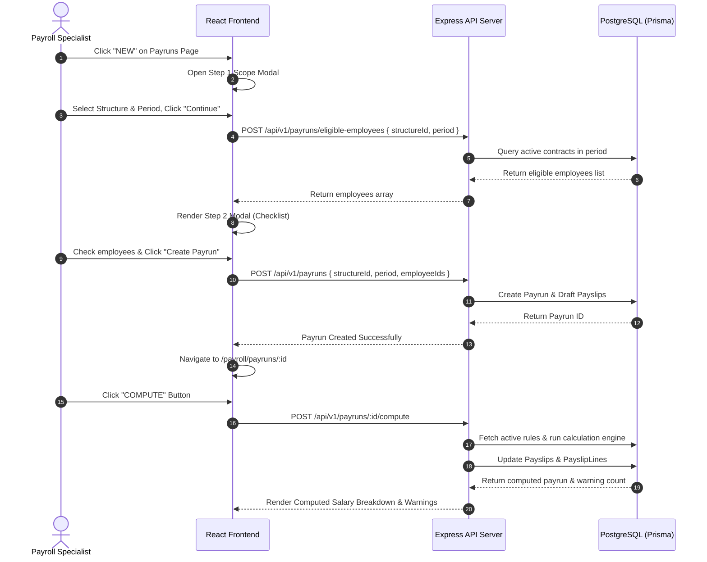
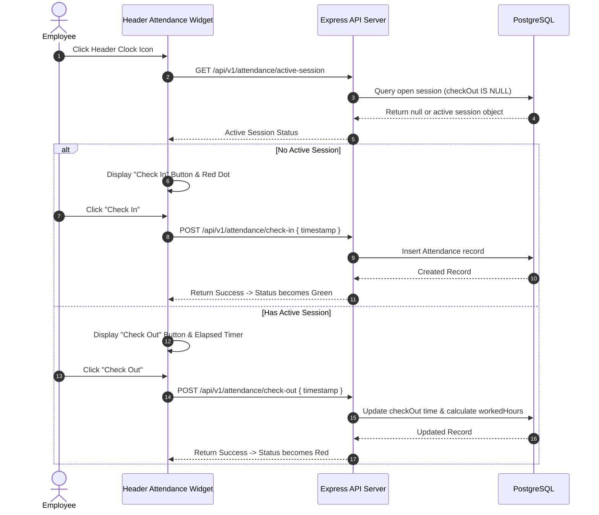

# PeoplePay360 / HRMS OXP - Frontend Application Architecture & UI Documentation

## 1. Executive Summary & Technology Stack

The **PeoplePay360 / HRMS OXP Frontend** is a modern, responsive Single Page Application (SPA) designed to deliver a smooth operational user experience for employees, HR officers, payroll specialists, and system administrators. It implements a unified enterprise design language with dynamic cards, live widgets, data tables with advanced filtering, Kanban boards, interactive charts, and multi-step workflow modals.

### Core Technology Stack
- **Framework**: React (v18.3+) with TypeScript (v5.0+)
- **Build Tool**: Vite (v5.2+)
- **Routing**: React Router DOM (v6.23+)
- **State Management**: React Context API (`AuthContext`, `PayrunContext`, `NotificationContext`) + Custom React Hooks
- **HTTP Client**: Axios (v1.6+) with request/response interceptors for JWT auth and standard error handling
- **UI & Iconography**: Lucide Icons (v0.370+), Vanilla CSS modules / Tailwind CSS
- **Data Visualization**: Recharts (v2.12+) for payroll dashboard charts
- **PDF Rendering**: `@react-pdf/renderer` / HTML-to-Canvas PDF client preview modal

---

## 2. Complete Frontend Folder Structure

```
frontend/
├── public/
│   ├── favicon.ico
│   └── logo.svg
├── src/
│   ├── assets/
│   │   └── images/
│   ├── components/
│   │   ├── attendance/
│   │   │   ├── AttendanceWidget.tsx       # Floating header timer & check-in modal (s13.png)
│   │   │   └── AttendanceTable.tsx        # Raw check-in/out records table (s11.png)
│   │   ├── common/
│   │   │   ├── Badge.tsx
│   │   │   ├── Button.tsx
│   │   │   ├── Card.tsx
│   │   │   ├── Modal.tsx
│   │   │   ├── SmartButton.tsx          # Employee form related-record counter pills
│   │   │   ├── Table.tsx
│   │   │   └── Tabs.tsx
│   │   ├── dashboard/
│   │   │   ├── AlertsCard.tsx             # Operational warnings & alerts list (s34.png)
│   │   │   ├── DepartmentCostChart.tsx    # Salary cost bar chart (s32.png)
│   │   │   ├── FilterBar.tsx              # Multi-select period & dept toolbar (s31.png)
│   │   │   ├── KpiCardGroup.tsx           # Net Salary, Payslips, Time Off KPIs (s31.png)
│   │   │   └── SalaryTrendChart.tsx       # Monthly salary trend line chart (s33.png)
│   │   ├── employees/
│   │   │   ├── EmployeeCard.tsx           # Kanban view individual card (s4.png)
│   │   │   ├── EmployeeForm.tsx           # Master form with tabs & smart buttons (s6.png)
│   │   │   └── EmployeeTable.tsx          # List view table (s5.png)
│   │   ├── layout/
│   │   │   ├── Header.tsx                 # Top navigation bar (s3.png, s37.png)
│   │   │   ├── MobileSidebar.tsx          # Responsive mobile drawer navigation (s38.png)
│   │   │   └── AppLayout.tsx
│   │   ├── payrun/
│   │   │   ├── PayrunStatusBadge.tsx
│   │   │   ├── PayrunWizardStep1Modal.tsx # Setup scope & period modal (s21.png)
│   │   │   └── PayrunWizardStep2Modal.tsx # Employee checklist selection modal (s22.png)
│   │   └── payslip/
│   │       ├── PayslipBreakdownTable.tsx  # Salary rule line items (s25.png)
│   │       └── PayslipPdfModal.tsx        # Printable PDF payslip modal (s26.png)
│   ├── context/
│   │   ├── AuthContext.tsx
│   │   ├── PayrunContext.tsx
│   │   └── NotificationContext.tsx
│   ├── hooks/
│   │   ├── useAttendanceTimer.ts
│   │   ├── useAuth.ts
│   │   ├── usePayrunWizard.ts
│   │   └── usePermissions.ts
│   ├── pages/
│   │   ├── AttendanceFormPage.tsx         # (s12.png)
│   │   ├── AttendanceListPage.tsx         # (s11.png)
│   │   ├── ContractFormPage.tsx           # (s8.png)
│   │   ├── ContractListPage.tsx           # (s7.png)
│   │   ├── EmployeeFormPage.tsx           # (s6.png)
│   │   ├── EmployeeListPage.tsx           # (s4.png, s5.png)
│   │   ├── LoginPage.tsx                  # (s1.png)
│   │   ├── PayrunProcessingPage.tsx       # (s23.png)
│   │   ├── PayrunsListPage.tsx            # (s20.png)
│   │   ├── PayslipComputationPage.tsx     # (s25.png)
│   │   ├── PayslipsListPage.tsx           # (s24.png)
│   │   ├── PayrollDashboardPage.tsx       # (s31.png - s37.png, s39.png)
│   │   ├── SalaryRuleFormPage.tsx         # (s30.png)
│   │   ├── SalaryRulesListPage.tsx        # (s29.png)
│   │   ├── SalaryStructureFormPage.tsx    # (s28.png)
│   │   ├── SalaryStructuresListPage.tsx   # (s27.png)
│   │   ├── TimeOffAllocationFormPage.tsx  # (s17.png)
│   │   ├── TimeOffAllocationsPage.tsx     # (s16.png)
│   │   ├── TimeOffRequestFormPage.tsx     # (s15.png)
│   │   ├── TimeOffRequestsPage.tsx        # (s14.png)
│   │   ├── TimeOffTypeFormPage.tsx        # (s19.png)
│   │   ├── TimeOffTypesListPage.tsx       # (s18.png)
│   │   ├── UserManagementPage.tsx         # (s2.png)
│   │   └── WorkingScheduleFormPage.tsx    # (s10.png)
│   │   └── WorkingScheduleListPage.tsx    # (s9.png)
│   ├── routes/
│   │   ├── AppRoutes.tsx
│   │   └── ProtectedRoute.tsx
│   ├── services/
│   │   ├── apiClient.ts
│   │   ├── attendance.service.ts
│   │   ├── auth.service.ts
│   │   ├── employee.service.ts
│   │   ├── payrun.service.ts
│   │   └── timeOff.service.ts
│   ├── types/
│   │   └── index.ts
│   ├── App.tsx
│   └── main.tsx
├── package.json
└── vite.config.ts
```

---

## 3. Comprehensive Image Reference Mapping (`s1.png` - `s39.png`)

Every visual asset in the `imagies/` directory represents a specific operational screen or component in the frontend application:

| Image File | Component / Page Name | Route Path | Functional Description | Consumed Backend API Endpoints |
| :--- | :--- | :--- | :--- | :--- |
| `s1.png` | `LoginPage` | `/login` | User login screen with work email & password form | `POST /api/v1/auth/login` |
| `s2.png` | `UserManagementPage` & `CreateUserModal` | `/admin/users` | Admin user table & Create/Edit User popup modal | `GET /api/v1/users`, `POST /api/v1/users` |
| `s3.png` | `Header` | *Global Header* | Top navbar showing Employees, Contracts, Attendance, Time Off, Payroll menus | N/A (Client Layout) |
| `s4.png` | `EmployeeListPage` (Kanban View) | `/hr/employees` | Employee Kanban view showing avatar cards & position badges | `GET /api/v1/employees?view=kanban` |
| `s5.png` | `EmployeeListPage` (List View) | `/hr/employees?view=list` | Employee table view for sorting, filtering, and bulk scanning | `GET /api/v1/employees?view=list` |
| `s6.png` | `EmployeeFormPage` | `/hr/employees/:id` | Employee master form with Smart Buttons (Contracts, Attendance, Time Off) | `GET /api/v1/employees/:id`, `PUT /api/v1/employees/:id` |
| `s7.png` | `ContractListPage` | `/hr/contracts` | List view of employee contracts with status indicators (`Running`, `Expired`) | `GET /api/v1/contracts` |
| `s8.png` | `ContractFormPage` | `/hr/contracts/:id` | Form view for single contract details, monthly wage, structure & schedule | `GET /api/v1/contracts/:id`, `POST /api/v1/contracts` |
| `s9.png` | `WorkingScheduleListPage` | `/hr/schedules` | Working schedules list displaying days/week, weekly hours & company | `GET /api/v1/schedules` |
| `s10.png` | `WorkingScheduleFormPage` | `/hr/schedules/:id` | Weekly pattern editor with day, start/end time, break, and auto-computed hours | `GET /api/v1/schedules/:id`, `POST /api/v1/schedules` |
| `s11.png` | `AttendanceListPage` | `/hr/attendance` | Table of check-in, check-out, worked hours, and status (`Present`, `Overtime`) | `GET /api/v1/attendance` |
| `s12.png` | `AttendanceFormPage` | `/hr/attendance/:id` | Form view of single attendance record for manual administrative corrections | `GET /api/v1/attendance/:id`, `PUT /api/v1/attendance/:id` |
| `s13.png` | `AttendanceWidget` | *Floating Widget* | Header timer widget popup with live elapsed time & Check-In/Out toggle button | `POST /api/v1/attendance/check-in`, `check-out` |
| `s14.png` | `TimeOffRequestsPage` | `/time-off/requests` | List of employee leave requests with Approve / Refuse actions | `GET /api/v1/time-off/requests` |
| `s15.png` | `TimeOffRequestFormPage` | `/time-off/requests/:id` | Detail form for leave request showing balance consumed & approver | `GET /api/v1/time-off/requests/:id`, `PUT .../approve` |
| `s16.png` | `TimeOffAllocationsPage` | `/time-off/allocations` | Table of leave allocations displaying Allocated, Taken, and Remaining days | `GET /api/v1/time-off/allocations` |
| `s17.png` | `TimeOffAllocationFormPage` | `/time-off/allocations/:id` | Form view for granting annual leave balance to employees | `GET /api/v1/time-off/allocations/:id`, `POST ...` |
| `s18.png` | `TimeOffTypesListPage` | `/time-off/types` | List of configured leave types (Paid Time Off, Sick Leave, Comp Off) | `GET /api/v1/time-off/types` |
| `s19.png` | `TimeOffTypeFormPage` | `/time-off/types/:id` | Configuration form for leave units, allocation rules, and approval type | `GET /api/v1/time-off/types/:id`, `POST ...` |
| `s20.png` | `PayrunsListPage` | `/payroll/payruns` | Payrun batches list showing pay period, total employees, and batch status | `GET /api/v1/payruns` |
| `s21.png` | `PayrunWizardStep1Modal` | Modal Popup | Step 1 of Payrun Creation Wizard: Select pay structure and payroll period | Client State Transition |
| `s22.png` | `PayrunWizardStep2Modal` | Modal Popup | Step 2 of Wizard: Eligible employee checklist & "Create Payrun" button | `POST /api/v1/payruns/eligible-employees`, `POST ...` |
| `s23.png` | `PayrunProcessingPage` | `/payroll/payruns/:id` | Processing workspace with Compute, Validate, Mark Paid, Send Payslips buttons | `POST /api/v1/payruns/:id/compute`, `validate`, `mark-paid` |
| `s24.png` | `PayslipsListPage` | `/payroll/payslips` | List of generated payslips for period with status & PDF links | `GET /api/v1/payslips` |
| `s25.png` | `PayslipComputationPage` | `/payroll/payslips/:id` | Detailed salary computation breakdown table (Basic, HRA, Gross, Deductions, Net) | `GET /api/v1/payslips/:id` |
| `s26.png` | `PayslipPdfModal` | Modal Preview | Printable PDF document preview modal with download & print trigger | `GET /api/v1/payslips/:id/pdf` |
| `s27.png` | `SalaryStructuresListPage` | `/payroll/structures` | List view of salary structures showing count of rules & linked employees | `GET /api/v1/salary-structures` |
| `s28.png` | `SalaryStructureFormPage` | `/payroll/structures/:id` | Form defining salary structure name and associated salary rules list | `GET /api/v1/salary-structures/:id` |
| `s29.png` | `SalaryRulesListPage` | `/payroll/rules` | List of salary rules exposing Name, Code, Category, Structure & Sequence | `GET /api/v1/salary-rules` |
| `s30.png` | `SalaryRuleFormPage` | `/payroll/rules/:id` | Form setting rule computation method (Fixed Amount, Percentage, Formula) | `GET /api/v1/salary-rules/:id`, `POST ...` |
| `s31.png` | `PayrollDashboardPage` (KPIs) | `/dashboard` | Executive KPI summary cards (Total Net Salary, Avg Salary, Attendance Health) | `GET /api/v1/dashboard/metrics` |
| `s32.png` | `DepartmentCostChart` | Component | Bar chart visualizing salary expenditure breakdown per department | `GET /api/v1/dashboard/department-costs` |
| `s33.png` | `SalaryTrendChart` | Component | Line chart tracking monthly net salary distribution over time | `GET /api/v1/dashboard/salary-trend` |
| `s34.png` | `AlertsCard` | Component | Payroll alerts panel highlighting missing bank accounts & duplicate payslips | `GET /api/v1/dashboard/alerts` |
| `s35.png` | `AttendanceOverviewCard` | Component | Attendance quality overview showing Present, Absent, Overtime counts | `GET /api/v1/dashboard/metrics` |
| `s36.png` | `DepartmentBreakdownTable` | Component | Department breakdown table combining headcount and total cost | `GET /api/v1/dashboard/department-costs` |
| `s37.png` | `Header` (Active Filters) | Global Layout | Top filter bar allowing dashboard period and department switching | Client Context |
| `s38.png` | `MobileSidebar` | Drawer Component | Collapsible responsive mobile drawer for small screens | Client State |
| `s39.png` | `SystemOverviewFlow` | Architectural | Full end-to-end operational diagram mapping HR to Payroll | Complete API Suite |

---

## 4. Key UI Components & Special Functionality

### 4.1 Employee Form & Smart Buttons (`s6.png`)
The `EmployeeFormPage` acts as the operational hub. At the top right of the form, dynamic **Smart Buttons** display live related record counts:
- `Contracts (2)`: Opens `/hr/contracts?employeeId=EMP001`
- `Attendance (14)`: Opens `/hr/attendance?employeeId=EMP001`
- `Time Off (3)`: Opens `/time-off/requests?employeeId=EMP001`
- `Allocations (1)`: Opens `/time-off/allocations?employeeId=EMP001`

### 4.2 Attendance Quick Action Widget (`s13.png`)
Located in the global header, clicking the red clock icon opens the floating `AttendanceWidget`:
- Displays greeting ("Welcome back, User Name!").
- Shows real-time counter clocking elapsed work time ("6h 56m").
- Toggles state:
  - If no active session -> Big Green **Check In** button.
  - If checked in -> Big Red **Check Out** button.
- Status indicator dot switches between **Red (Checked Out)** and **Green (Checked In)**.

### 4.3 Payrun Creation Wizard (2-Step Modal) (`s21.png`, `s22.png`)
1. **Step 1 (Scope Setup)**: User selects Pay Structure (e.g. "Regular Pay") and Period (`Sep 1 -> Sep 30`). Clicking **Continue** does **not** create a Payrun; it advances to Step 2.
2. **Step 2 (Employee Selection)**: Fetches eligible employees for the selected scope. Displays a multi-select table with checkboxes. User selects employees and clicks **Create Payrun**. Only selected employees are included in the generated Payrun.

---

## 5. User Action to API Interaction Sequence Diagrams

### 5.1 Payrun Creation & Batch Computation Flow



---

### 5.2 Attendance Check-In / Check-Out Flow


